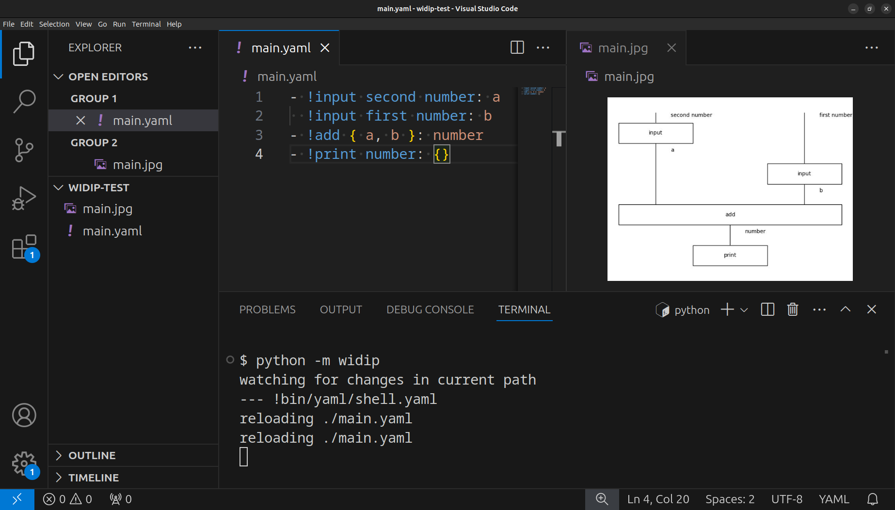

Widip: Wiring Diagram Processing
-----

Widip is a fast user interface that keeps pace with graphical reasoning.

## `Hello world!`

```
$ git clone https://github.com/colltoaction/widip.git
$ cd widip
$ pip install yaml discopy watchdog
$ python . examples/hello-world.yaml
Hello world!
$ open examples/hello-world.jpg
```


## Introduction

Widip is an [interactive environment] for building wiring diagram catalogs.

Users have two modes of interaction:
* the [filesystem]
* a [chatbot] or [command-line interface]

### Filesystem
Widip seamlessly integrates with editors and CLIs for Linux and MacOS as a [UNIX shell].

Diagrams are written as `.yaml` documents and are meant for human authors. Widip watches the filesystem for any changes to source and immediately renders updated images to keep pace with graphical reasoning.

In this lightweight environment users can use their own tools for editing text and viewing images. As an example, VS Code will automatically reload `README.md`s and `.jpg` tabs when files change.

## Environment
### Built-in documentation
You will find the documentation alongside the text and images in the filesystem.

### Setup
A typical VS Code setup looks like:



1. Open terminal and run `python .` to start an interactive session
2. While running, `.jpg`s will be reloaded on file changes
3. Open `.yaml` and `.jpg` files side by side for a fast feedback loop

Python starts an interactive session with the program `bin/yaml/shell.yaml` and you see a prompt just like in Bash or Python. `↵ Enter` evaluates the line and `⌁ Ctrl+D` exits.

```
$ python .
watching for changes in current path
--- !bin/yaml/shell.yaml
!!python/eval 40+2
42
--- !bin/yaml/shell.yaml
⌁
```

## Widi programs

Programming is hard, but it shouldn't be _that_ hard.

Widis are [graphical programming](https://graphicallinearalgebra.net/2015/04/26/adding-part-1-and-mr-fibonacci/) tools that have two main operations: parallel and sequential composition. As a formal method they have excellent properties to connect open systems like programs. High-level diagrams decouple program logic from the primitives implementation.

To program with widis we build a functional library in Widip itself. As an example core abstractions like `bool` or `maybe` can be found in the [src/data](src/data) directory. We grow a self-contained fully-dynamic system with the goal of bootstrapping.

## Inspiration

* UNIX: pipelines, everything is a file
* LISP: code as data
* Clojure: everything LISP + extended syntax
* Idris: dependently-typed implementations

## Developing the bootstrap code
The Python codebase uses DisCoPy for processing the widi using the Cospans of Hypergraphs data structure and drawing with Matplotlib.

### Why YAML

YAML is a widely-adopted human-friendly language for describing object relations. We leverage several features to create an elegant textual representation of arbitrary widis.

### Why UNIX

UNIX is a key piece in the computing world. This environment is standard from developer workstations to production servers. We use it to create a productive developer experience and server workloads with minimal dependencies.


[UNIX shell]: https://en.wikipedia.org/wiki/Unix_shell
[chatbot]: https://en.wikipedia.org/wiki/chatbot
[command-line interface]: https://en.wikipedia.org/wiki/Command-line_interface
[filesystem]: https://en.wikipedia.org/wiki/File_manager
[interactive environment]: https://en.wikipedia.org/wiki/Read%E2%80%93eval%E2%80%93print_loop